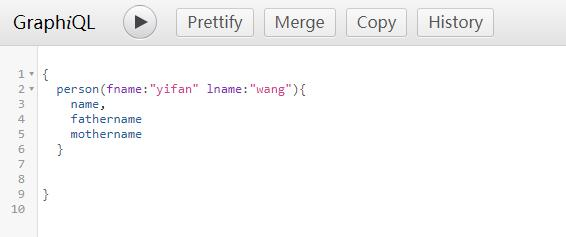
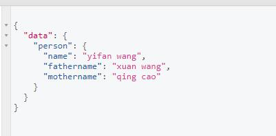
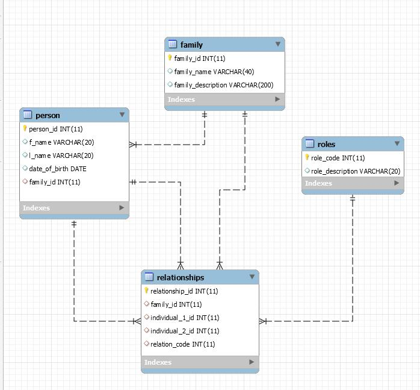
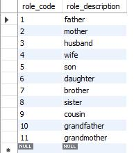

# Family Tree App

## Preview of web interface (currently unavaliable will be update in next week):
https://skynapier.github.io/family_tree_app_react/

## Task:

* Build a GraphQL Server 
* Write some queries
* Write a react front-end to do queries (e.g. a Family Tree app)
* Build a database to store and retrieve information in e.g. mysql
* Connect the GraphQL API to the database
* (Handle the n+1 problem)

## How to run my program： 
* my program needs node.js, express.js, mysql,cors, React.js and express-graphql environment

* util/util.js for connect mysql database "family" 
* server.js for GraphQL + express server
* family_tree_backup.sql is the buckup for family tree database schema

### command: node server.js: 
* then the server running at http://127.0.0.1:4000/graphql
* I currently allow graphiql to get a GUI for debugging, in further i will use /?query={"your query"}} for GET request 

### currently query API example in Graphiql

### currently output looks like

### EER Diagram:

* role descrption table:

* for the relationship table 
* role_code means individual_1 is individual_2's relative role.
* e.g alice is bob's mother.

### web interface github link (currently unavailable will be update in next week):
https://github.com/skynapier/family_tree_app_react

## update 27 Aug 
* optimized database structure, add auto increment trigger to the id field
* create DAO(data access objec) layer 
* enrich documentation 
* update query table based on the new database structure

## update 26 Aug
* decoupling graphql schema into schema.js
* decoupling mysql connection pool into util/util.js
* merge Graphql and mysql together which means after querying then using GrahqlAPI for return values

## update 1 Aug
* write some GraphQL Queries
* add CORS
* add Axios on React interface

## update 23-24 July
* Add web interface build in React.js 
* Handle layout content Router 
* Navigation bar could show jump to homepage and show page
* Try something about Asynchronous
* At show page when you input something at input bar then could shown on the tree node

## update 22 July
add server_mysql.js 

## QA
1. [SELECT ERROR]: ER_HOST_NOT_PRIVILEGED: Host '192.168.1.9' is not allowed to connect to this MySQL server
* CREATE USER 'username'@'localhost' IDENTIFIED BY 'password';

* GRANT ALL PRIVILEGES ON *.* TO 'username'@'localhost' WITH GRANT OPTION;

* CREATE USER 'username'@'%' IDENTIFIED BY 'password';

* GRANT ALL PRIVILEGES ON *.* TO 'username'@'%' WITH GRANT OPTION;

* FLUSH PRIVILEGES;

2.  [SELECT ERROR]: ER_NOT_SUPPORTED_AUTH_MODE: Client does not support authentication protocol requested by server; consider upgrading MySQL client
* alter user 'root'@'localhost' identified with mysql_native_password by '123456';

* flush privileges;

3. mysql dump commend 
* cd into mysql_server/bin dir
* sudo mysqldump -u[username] -p {databasename or --all databases} > dir.sql
